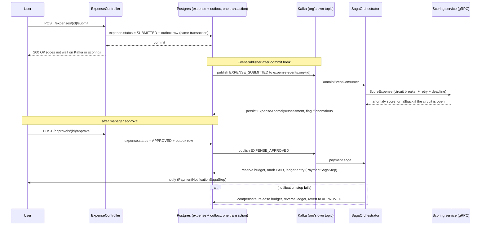

# Architecture

Event sourcing, per-tenant Kafka isolation, sagas, and the gRPC scoring client. CRUD for expenses, leave, timesheets, and payroll is a standard Spring Boot layered app; the code is the documentation for that part.

## Expense lifecycle

## Outbox

Publishing to Kafka inside the same method that saves the entity can diverge: Kafka succeeds and the DB rolls back, or the DB commits and Kafka fails.

`EventPublisher` writes the event to `domain_events` in the same transaction as the business change, then sends to Kafka in an `afterCommit()` hook. If the transaction never commits, nothing is sent. If the process dies between commit and publish, `OutboxRelay` resends unpublished rows after a grace period.

## One Kafka topic per organization

Topics are named `expense-events.org-{id}`. A shared topic would let one org's burst add consumer lag for everyone else, and retention or ACLs could only be set globally.

`KafkaTopicInitializer` creates one topic per organization at startup. `DomainEventConsumer` subscribes with a regex pattern so a newly registered org is picked up without a restart.

## Payment saga

Approve, reserve budget, mark paid, and notify cannot be one `@Transactional` method once notify talks to SMTP or WebSocket. Those steps live outside the database.

`SagaOrchestrator` runs `PaymentSagaStep` then `PaymentNotificationSagaStep`. If notify throws, `PaymentSagaStep.compensate()` releases the budget, reverses the ledger row, and sets status back to `APPROVED`. `SagaExecution` records `IN_PROGRESS` / `COMPLETED` / `COMPENSATING` / `COMPENSATED` / `FAILED`.

`AnomalyScoringSagaStep.compensate()` is empty: it only writes a new assessment row.

## Scoring circuit breaker

`GrpcAnomalyScoringClient` wraps the gRPC call in Resilience4j (`resilience4j.circuitbreaker.instances.anomalyScoring` in `application.yml`). Scoring is optional. If the scorer is slow or down, the expense still submits and is flagged for manual review. Once the failure or slow-call rate crosses the threshold, the breaker opens and `scoreFallback()` returns an unavailable result for `wait-duration-in-open-state`.

## Multi-tenancy

Row-level: tenant-scoped entities carry `organization_id`, and repository queries filter on it.

Event-level: per-org Kafka topics keep async processing isolated the same way.
