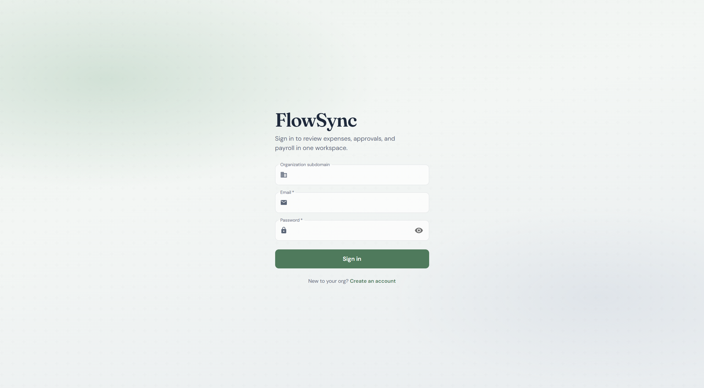

<div align="center">

# FlowSync

Multi-tenant expense, leave, timesheet, and payroll platform.

Each organization gets its own Kafka topic. Expense submissions are scored for anomalies by a separate Python service. Budget reservation and payment run as a saga, with a compensating rollback if a later step fails.



[Architecture](ARCHITECTURE.md)

<br/>


</div>

## What it does

- Per-org Kafka topics (`expense-events.org-{id}`) so one tenant's burst does not stall everyone else
- Transactional outbox, then Kafka publish after commit
- Payment saga: reserve budget → mark paid → notify, with compensate if notify fails
- Anomaly scoring over gRPC (Isolation Forest + calibrator), with a circuit breaker so a down scorer does not block submit
- Row-level `organization_id` filtering plus event-level isolation

## Stack

| Area | Tech |
|---|---|
| Backend | Java 17, Spring Boot 3.2, PostgreSQL, Redis, Kafka, gRPC, Resilience4j, JWT |
| Scoring | Python 3.11, FastAPI, scikit-learn, gRPC |
| Frontend | React 18, MUI 5, Vite |
| Infra | Docker Compose, GitHub Actions |

## Run locally

Copy [`.env.example`](.env.example) to `.env` if you want to override defaults.

```bash
docker compose up -d --build
```

This starts Postgres, Redis, Kafka, the backend (`:8080`), the scoring service (`:8000` REST, `:50051` gRPC), and the frontend (`:3000`).

The backend seeds five demo organizations on first boot.

### Backend only

Needs Postgres on `localhost:5432` (`docker compose up -d postgres` is enough).

```bash
cd backend
mvn clean install
DB_USER=postgres DB_PASSWORD=postgres mvn spring-boot:run
```

`DB_PASSWORD` must be set when Postgres has a password. For sagas and scoring to run (not just fail open), also start Kafka (`localhost:9092`) and the scoring service (`localhost:50051`).

### Scoring service only

```bash
cd ml-service
python3 -m venv .venv && source .venv/bin/activate
pip install -r requirements.txt
python3 data/generate_dataset.py && python3 train.py
uvicorn app.main:app --reload --port 8000
```

### Frontend only

```bash
cd frontend
npm install
npm run dev
```

The Vite dev server proxies `/api` to `http://localhost:8080`. No `VITE_API_URL` is required.

## Demo credentials

Seeded by `DataSeeder.java` against an empty database. Main org is TechCorp Solutions.

| Role | Email | Password |
|------|-------|----------|
| Admin | `admin@techcorp.com` | `admin123` |
| Manager | `manager1@techcorp.com` | `manager123` |
| HR | `hr1@techcorp.com` | `hr123` |
| Finance | `finance1@techcorp.com` | `finance123` |
| Employee | `employee1@techcorp.com` ... `employee5@techcorp.com` | `employee123` |
| Partner org | `manager@<subdomain>.com` / `employee@<subdomain>.com` | `partner123` |

Partner subdomains: `meridian`, `harborlight`, `ferngrove`, `cobaltpeak`.

## Tests

```bash
cd backend && mvn test
cd ml-service && pytest
cd frontend && npm test -- --run
```

CI (`.github/workflows/ci.yml`) runs the backend and frontend suites on push and pull request to `main` or `develop`.

## License

All rights reserved.
